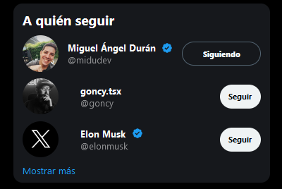
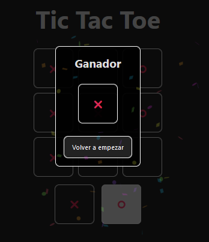

# Aprendiendo React

Version propia del mono-repositorio multipaquete creado por [@midudev](https://github.com/midudev) en el Curso de React 2023[^1], además se añade un directorio con las muestras finales o muestras esperadas de cada proyecto

# Proyectos

Según se van realizando los proyectos, se estará actualizando los README para dar una visual de cada uno desde la vista principal. Hasta ahora se llevan los siguientes proyectos:

## [Twitter follow card ➡️](./projects/01-Twitter-follow-card/README.md)

El objetivo principal de este proyecto es crear el componente de la tarjeta "*A quién seguir*" del actual sitio **X** y antigüo **Twitter** para aprender cómo es la creación de componentes en React siguiendo la recomendación de Atomic design[^2] y la comprensión del hook **useState**

## [Tic tac toe ➡️](./projects/02-tres-en-raya/README.md)

El objetivo principal de este proyecto es crear una versión del juego Tic Tac Toe o Tres en raya para aprender y afianzar los conocimientos del anterior hook **useState** y la comunicación entre componentes y elementos de React

[^1]: [Curso de React 2023](https://www.youtube.com/playlist?list=PLUofhDIg_38q4D0xNWp7FEHOTcZhjWJ29)\
[^2]: [Atomic design](https://bradfrost.com/blog/post/atomic-web-design/)