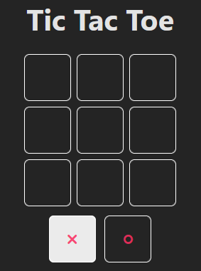
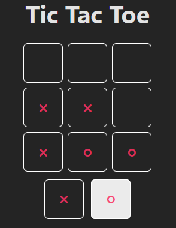

# Tres en raya / Tic tac toe

Primer acercamiento a React[^1] con Vite[^2] del Curso de React 2023[^3] dictado por [@midudev](https://github.com/midudev).

Aquí se muestra el resultado final del primer micro-proyecto con estilos propios:

[^1]: [React](https://es.react.dev)
[^2]: [Vite](https://vitejs.dev)
[^3]: [Curso de React 2023](https://www.youtube.com/playlist?list=PLUofhDIg_38q4D0xNWp7FEHOTcZhjWJ29)
